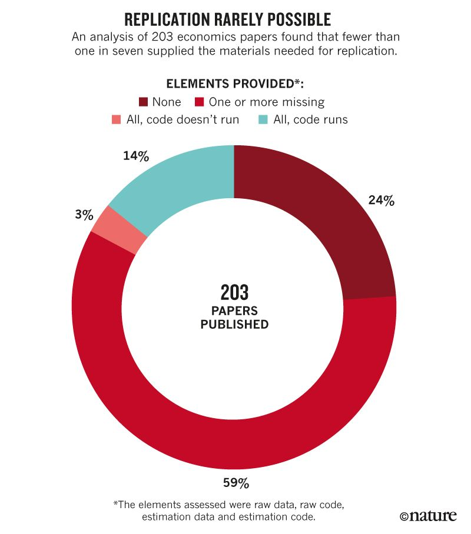

# What We're All About

We're in our **seventh semester** of offering seminars on using `R` for data science.

</br>

We were founded in **2015** by Chris, Christina Garcia and Kelly Lovejoy.

</br>

We are a **collaborative, interdisciplinary** group at Saint Louis University focused on **building community** around open source software and open science.

---

# What We're All About

We `r emojifont::emoji('heart')` `R`, RStudio, open data, and open science!

--

</br>

Our seminars cover *most* of data science workflow from Wickham and Grollman (2016):

```{r add-workflow-image, echo=FALSE}
knitr::include_graphics("assets/workflow.png")
```

---

# The State of Academic Research

Woelfle, Olliaro, and Todd (2011): 

> Academia is associated with the free transmission of data and resources, but in many ways this is no longer how it operates. The scientific community generally works towards common goals by competition between closed groups of scientists and communicates research results through publications relying on pre-publication peer-review. Papers frequently omit some experimental information, or ignore negative results. The delays involved in publication of papers, or reviewing of grants are significant.

---

# The Replication "Crisis"

```{r add-replication-img-1, echo=FALSE, out.width = "80%", fig.align = "center"}
knitr::include_graphics("assets/Baker_2016_1.jpeg")
```

---

# Uneven Responses to the Replication "Crisis"

```{r add-replication-img-2, echo=FALSE, out.width = "90%", fig.align = "center"}
knitr::include_graphics("assets/Baker_2016_2.jpg")
```

---

# Uneven Responses to the Replication "Crisis"

```{r add-replication-img-3, echo=FALSE, out.width = "80%", fig.align = "center"}
knitr::include_graphics("assets/GertlerEtAl_2018_1.jpg")
```

---

# Uneven Responses to the Replication "Crisis"

```{r add-replication-img-4, echo=FALSE, out.width = "60%", fig.align = "center"}

```

---

# Open Science to the Rescue?

One problem is that we do not have a cohesive definition of open science. Is it publishing data online? Providing code? Something else?

--

</br>

Gertler, Galiani, and Romero (2018):

> We were able to replicate only a small minority of these papers. Overall, of the 203 studies, 76% published at least one of the 4 files required for replication: the raw data used in the study (32%); the final estimation data set produced after data cleaning and variable manipulation (60%); the data-manipulation code used to convert the raw data to the estimation data (42%, but only 16% had both raw data and usable code that ran); and the estimation code used to produce the final tables and figures (72%).

---

# Open Science to the Rescue!

Possible elements:

1. the raw data used in the study
2. the final estimation data set produced after data cleaning and variable manipulation
3. the data-manipulation code used to convert the raw data to the estimation data
4. the estimation code used to produce the final tables and figures

---

# Open Science to the Rescue!

Possible elements:

1. pre-registered hypotheses
2. protocols and research materials
3. research logs
4. the raw data used in the study
5. the final estimation data set produced after data cleaning and variable manipulation
6. the data-manipulation code used to convert the raw data to the estimation data
7. the estimation code used to produce the final tables and figures

---

# Open Science to the Rescue!

Possible elements:

1. pre-registered hypotheses
2. protocols and research materials
3. research logs
4. the raw data used in the study
5. the final estimation data set produced after data cleaning and variable manipulation
6. the data-manipulation code used to convert the raw data to the estimation data
7. the estimation code used to produce the final tables and figures
8. all code should run on any computer

---

# Open Science to the Rescue!

Possible elements:

1. pre-registered hypotheses
2. protocols and research materials
3. research logs
4. the raw data used in the study
5. the final estimation data set produced after data cleaning and variable manipulation
6. the data-manipulation code used to convert the raw data to the estimation data
7. the estimation code used to produce the final tables and figures
8. all code should run on any computer
9. all of the above materials should be available online in a format that makes them citeable

---

# Open Science to the Rescue!

Possible elements:

1. pre-registered hypotheses
2. protocols and research materials
3. research logs
4. the raw data used in the study
5. the final estimation data set produced after data cleaning and variable manipulation
6. the data-manipulation code used to convert the raw data to the estimation data
7. the estimation code used to produce the final tables and figures
8. all code should run on any computer
9. all of the above materials should be available online in a format that makes them citeable
10. results are available without paywall

---

# How do we do this?

1. Use the Open Science Framework (OSF) for:
    * pre-registration
    * cataloging **all** research materials
    * creating a DOI number to make work citeable
    * publish pre-prints of findings

---

# How do we do this?

1. Use the Open Science Framework (OSF) for:
    * pre-registration
    * cataloging **all** research materials
    * creating a DOI number to make work citeable
    * publish pre-prints of findings
2. If you want to make data citeable independent of a single project, use Zenodo, figshare, or another service that creates DOI numbers for data sets

---

# How do we do this?

1. Use the Open Science Framework (OSF) for:
    * pre-registration
    * cataloging **all** research materials
    * creating a DOI number to make work citeable
    * publish pre-prints of findings
2. If you want to make data citeable independent of a single project, use Zenodo, figshare, or another service that creates DOI numbers for data sets
3. If you want the most robust option for executable code, pair OSF with GitHub or Gitlab
